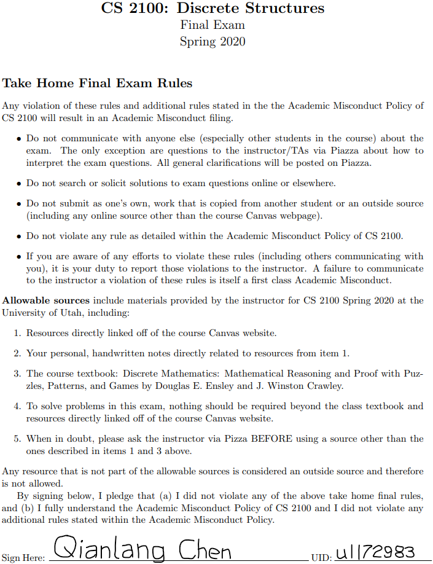
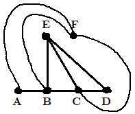
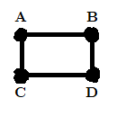
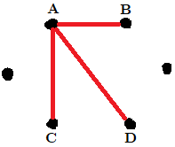
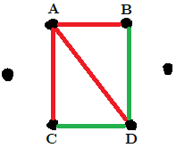

```{r setup, include=FALSE}
knitr::opts_chunk$set(echo = TRUE)
```



\pagebreak
# Problem 1

## Part (a)

7, 22, 11, 34, 17, 52, 26, 13, 40, 20, 10, 5, 16, 8, 4, 2, 1.

## Part (b)

$$f(x) = (1 - (x \bmod 2))(\frac{1}{2}x) + (x \bmod 2)(3x + 1)$$

\pagebreak
# Problem 2

**Step I, Problem Statement:** let $P(n)$ be that $\sum_{i=0}^n x_i = x_{n+5} - 2$ is true, where
$$
\begin{aligned}
  x_n = x_{n-2} + x_{n-3};\\
  x_0 = x_1 = x_2 = 1
\end{aligned}
$$
Show that $P(n)$ is true for all integers $n \ge 0$.

**Step II, Base Case:** show that $P(0)$ is true, meaning that $\sum_{i=0}^n x_i = x_{n+5} - 2$ when $n = 0$.

Proof: when $n = 0$, we have
$$
\begin{aligned}
  \sum_{i=0}^n x_i &= x_0 = 1;\\
       x_{n+5} - 2 &= x_5 - 2 = 3 - 2 = 1 = \sum_{i=0}^n x_i
\end{aligned}
$$
Therefore, $P(0)$ is true.

**Step III, Inductive Hypothesis:** assume that $P(m)$ is true for some $m \ge 1$. This means that
$$\sum_{i=0}^m x_i = x_{m+5} - 2$$

**Step IV, Inductive Step:** show that $P(m + 1)$ is true, meaning that
$$\sum_{i=0}^{m+1} x_i = x_{m+6} - 2$$

Proof:
$$
\begin{aligned}
  \sum_{i=0}^{m+1} x_i &= x_{m+1} + (\sum_{i=0}^m x_i)\\
                       &= x_{m+1} + (x_{m+5} - 2)\\
                       &= x_{m+1} + x_{m+2} + x_{m+3} - 2\\
                       &= x_{m+4} + x_{m+3} - 2\\
                       &= \boxed{x_{m+6} - 2}
\end{aligned}
$$
Therefore, $P(m + 1)$ is true, completing the induction proof. $\square$

\pagebreak
# Problem 3

$$
\begin{aligned}
  (b' + a) \cdot (b + c) \cdot (a + c') &= (b + c) \cdot (b' + a) \cdot (a + c')    &\text{Commutative}\\
                                        &= (b + c) \cdot (a + b') \cdot (a + c')    &\text{Commutative}\\
                                        &= (b + c) \cdot ((a + b') \cdot (a + c'))  &\text{Associative}\\
                                        &= (b + c) \cdot (a + b'c')                 &\text{Inv. Distributive}\\
                                        &= (b + c) \cdot a + (b + c) \cdot (b'c')   &\text{Distributive}\\
                                        &= a \cdot (b + c) + (b + c) \cdot (b'c')   &\text{Commutative}\\
                                        &= a \cdot (b + c) + (b + c) \cdot (b + c)' &\text{De Morgan's}\\
                                        &= a \cdot (b + c) + 0                      &\text{Negation}\\
                                        &= \boxed{a \cdot (b + c)}                  &\text{Identity}\\
\end{aligned}
$$

\pagebreak
# Problem 4

## Part (a)

Let elements $p, q$, and $r$ be given such that $(p, q, r) \in P' \times Q' \times R'$.

By definition of cross products, $p \in P', q \in Q'$, and $r \in R'$.

By definition of set complements, $p \notin P, q \notin Q$, and $r \notin R$.

By definition of cross products, $(p, q, r) \notin P \times Q \times R$.

By definition of set complements, $(p, q, r) \in (P \times Q \times R)'$.

Therefore, by definition of a subset, $P' \times Q' \times R' \subseteq (P \times Q \times R)'$. $\square$

## Part (b)

Let a set $E$ be given such that $E \in \wp(A') - \{\emptyset\}$.

By definition of a set difference, $E \in \wp(A')$ and $E \notin \{\emptyset\}$.

Since $E \notin \{\emptyset\}$, the set $E$ is not empty. Let an element $e \in E$ be given.

Since $E \in \wp(A')$, by definition of a power set, $e \in A'$.

By definition of a set complement, $e \notin A$.

Since $e \in E$, but $e \notin A$, by definition of a power set, $E \notin \wp(A)$.

By definition of a set complement, $E \in (\wp(A))'$.

Therefore, by definition of a subset, $E \in \wp(A') - \{\emptyset\} \subseteq E \in (\wp(A))'$. $\square$

\pagebreak
# Problem 5

## Part (a)

An example of such a function $f$:
$$A = \{1\}; f : A \to A, f = \{(1, 1)\}$$

## Part (b)

$$
\begin{aligned}
  f \circ f \circ f &= \{(1, f(f(f(1)))), (2, f(f(f(2)))), (3, f(f(f(3)))), (4, f(f(f(4))))\}\\
                    &= \{(1, f(f(2))), (2, f(f(1))), (3, f(f(1))), (4, f(f(4)))\}\\
                    &= \{(1, f(1)), (2, f(2)), (3, f(2)), (4, f(4))\}\\
                    &= \boxed{\{(1, 2), (2, 1), (3, 1), (4, 4)\}}
\end{aligned}
$$

## Part (c)

$$Q^* = \{(1, 2), (1, 3), (1, 4), (3, 2), (3, 3), (3, 4)\}$$

\pagebreak
# Problem 6

## Part (a)

The answer is the same as the number of ways to form a subset of 9 items out of 20 items:
$$C(20, 9) = \frac{20!}{(20 - 9)! \times 9!} = \boxed{\frac{20!}{11! \times 9!}}$$

## Part (b)

The process is the same as already have that one "must-have" player and choosing 8 other players from the remaining 19 players:
$$C(19, 8) = \frac{19!}{(19 - 8)! \times 8!} = \boxed{\frac{19!}{11! \times 8!}}$$

## Part (c)

The process is the same as choosing 9 players from the remaining 19 "useable" players:
$$C(19, 9) = \frac{19!}{(19 - 9)! \times 9!} = \boxed{\frac{19!}{10! \times 9!}}$$

\pagebreak
# Problem 7

## Part (a)

Since there are 2 red Kings, 2 black Jacks, and 20 red number-cards, the number of ways to choose one from each, in order, is
$$2 \times 2 \times 20 = 80$$
Meanwhile, the total number of ways to get 3 cards out of a 52-card deck is
$$P(52, 3) = \dfrac{52!}{(52 - 3)!} = \frac{52!}{49!}$$
Therefore, the total probability is
$$80 \div \frac{52!}{49!} = \boxed{\frac{80 \times 49!}{52!}}$$

## Part (b)

Since there are 4 different suits, after player A gets dealt a hand of royal flush, there are only 3 possible suits to build a hand of royal flush on. This means that there are 3 ways for B to get a hand of royal flush after A getting a royal flush.

Meanwhile, the total number of ways to get a hand from the remaining 47 cards (after dealing A's hand) is
$$C(47, 5) = \frac{47!}{(47 - 5)! \times 5!} = \frac{47!}{42! \times 5!}$$

Therefore, the total probability is
$$3 \div \frac{47!}{42! \times 5!} = \boxed{\frac{3 \times 42! \times 5!}{47!}}$$

\pagebreak
# Problem 8

## Part (a)

Since there are 36 possible outcomes for rolling a pair of dice, there are 35 ways to not get a double-six on any roll. This means that the probability of not getting a double-six on one roll is $\dfrac{35}{36}$.

Now, since each roll is independent from any other rolls, the probability of not getting a single double-six on 20 rolls is $(\dfrac{35}{36})^{20}$.

Therefore, by definition of an event's complement, the probability of getting at least one double-six on 20 rolls is $\boxed{1 - (\frac{35}{36})^{20}}$.

## Part (b)

Since each team in each round have a $\dfrac{1}{2}$ chance of beating the other team and there are 3 rounds, it means that each person playing the guessing game has a $(\dfrac{1}{2})^4 \times (\dfrac{1}{2})^2 \times \dfrac{1}{2} = \dfrac{1}{128}$ chance of guessing every outcome correctly.

This also means that a person playing the guessing game has a $\dfrac{1}{127}$ chance to win $20 - 2 = 18$ dollars and has a $\dfrac{127}{128}$ chance of losing 2 dollars.

Therefore, each person is expected to win
$$\boxed{\frac{1}{128} \times 18 + \frac{127}{128} \times (-2)}$$
dollars when playing this guessing game.

\pagebreak
# Problem 9

## Part (a)

Yes. Every vertex in $G_1$ has an even degree.

## Part (b)

Yes. There exists a trial in $G_1$ that visits every edge in this graph exactly once.

## Part (c)

There are two connected components in $G_2$:

  1. $\{a, b, c, e, f, g\}$;
  
  2. $\{d, h, i\}$.

## Part (d)

Yes, $G_3$ is planar:



## Part (e)

No, $G_4$ is not planar since it contains a subdivision of six vertices, where 3 of them are connected to each of the other 3 ($\{a, c, e\}$ and $\{b, d, f\}$).

\pagebreak
# Problem 10

## Part (a)

In the induction step, Nancy built a new graph with $m$ vertices based on a graph with $(m - 1)$ vertices that already has a cycle of 3. The way she built it was only by adding the vertices and new edges, but not removing edges. This does not cover every possible valid graph $H$ with $m$ vertices. Therefore, her induction does not hold.

## Part (b)

The claim is not always true. The following graph contains 4 vertices with each vertex having a degree of 2. However, it does not contain a cycle of 3:



\pagebreak
# Problem 11

First, let us assume that it is possible to color in all edges without creating any triangles with all three edges being the same color (the opposite of the problem statement).

Since every vertex in the graph is an end of 5 different edges, and since we only have 2 colors, by PHP, there must be at least 3 of the edges having the same color. Let us call this vertex $A$ and call the vertices it is connected to via those 3 edges $B, C$, and $D$:



Since we do not want to create a triangle with all edges being the same color, namely the triangles $\triangle ABD$ and $\triangle ACD$, let the edges $BD$ and $CD$ be in the other color instead:



Now, we cannot color in the edge $BC$ with either red or green without making either the triangles $\triangle ABC$ or $\triangle BCD$ having all edges being the same color. This means that our assumption in the beginning is wrong. Therefore, we cannot color in every edge in the graph so that there is not a triangle with all edges being the same color. $\square$

