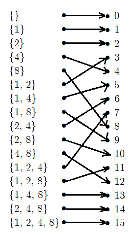
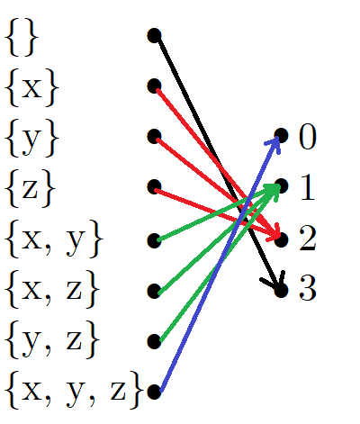
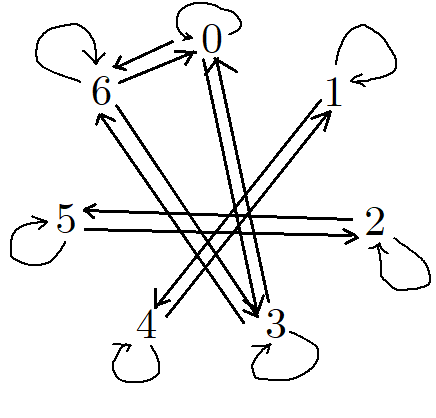
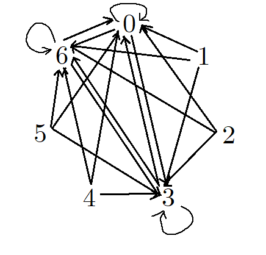

```{r setup, include=FALSE}
knitr::opts_chunk$set(echo = TRUE)
```

# Section 4.1 (p266)

## 1. Exercise 9.c



## 2. Exercise 13

(a).

## 3. Exercise 18.b

The inverse function $f^{-1}(x) = g(x) = \frac{x}{3} - \frac{5}{3}$.

**Proof:** let an element $x \in \mathbb{R}$ be given.
$$
\begin{aligned}
  g(f(x)) &= g(3x + 5) \\
          &= \frac{3x + 5}{3} - \frac{5}{3} \\
          &= x - \frac{5}{3} + \frac{5}{3} \\
          &= x
\end{aligned}
$$

By definition of an inverse function, $g(x)$ is the inverse of $f(x)$.

## 4. For each of the following Java methods, state whether or not it meets the definition of a function with domain and codomain `Color`. If not, state the reason why.

### Part (a)

Yes.

### Part (b)

No. Colors with `red` values different than `green` values is not covered by the output, since the outputting colors always have the same `red` and `green` values.

### Part (c)

Yes.

## 5. Implement a method that is the inverse of the *grayscale* method above, i.e. *grayscale*^*-1*^, or state why *grayscale* is not invertible:

This function is not invertible because its input space is bigger than its output space, meaning that the function is not one-to-one. The input space is all colors with RGB values that can each be distinct, whereas the function only outputs colors with the same values for RGB.

\pagebreak
# Section 4.2 (p277)

## 6. Exercise 2.a

$$
\begin{aligned}
  (g \circ f)(z) &= g(f(z)) \\
                 &= g(2z + 1) \\
                 &= \boxed{(2z + 1)^2 - 1}
\end{aligned}
$$

## 7. Exercise 4

$n \circ c$ is defined.

  * **Domain:** $\wp(\{x, y, z\})$;
  
  * **Codomain:** $\{0, 1, 2, 3\}$;
  
  * **Arrow diagram:**



## 8. Exercise 23

  * **Arrow diagram for $R$:**



  * **Arrow diagram for $R \circ R$:**



  * **Rule for $R \circ R$:** $x (R \circ R) y$ if $x - (x - y)$ is divisible by 3.

## 9. Implement a method that is the *grayscale* method composed with the negative method, i.e. *grayscale* $\circ$ *negative*, or state why it is not possible.

```{java}
/** Returns a new Color that is the grayscale of the negative of the given Color. */
public static Color grayscaleComposedWithNegative(Color c)
{
    Color neg = new Color(255 - c.red, 255 - c.green, 255 - c.blue);
    
    int average = (neg.red + neg.green + neg.blue) / 3;
    return new Color(average, average, average);
}
```

\pagebreak
# Section 4.3 (p298)

## 10. Exercise 4.b

This function is neither one-to-one, onto, nor invertible.

## 11. Exercise 9

Let $c \in C$ be given. Since the function $g$ is onto, there must exist a $b \in B$ such that $g(b) = c$. Since the function $f$ is also onto, there must exist an $a \in A$ such that $f(a) = b$. If we take $a \in A$ such that $f(a) = b$, it follows that
$$(g \circ f)(a) = g(f(a)) = g(b) = c$$

Therefore, the function $g \circ f$ is also onto. $\square$

## 12. Exercise 13

First, let us show that the function $g$ is onto.

Let $n \in \mathbb{N}$ be given. Since every integer is either even or odd, one of the following cases about $n$ must be true:

**Case I,** when $n$ is even, meaning that $\exists k \in \mathbb{Z} : n = 2k$. It follows that $n = 2k = -2 \cdot (-k) = -2z$, where $z = -k$. By closure under addition and multiplication, $z \in \mathbb{Z}$. Also, since $n \in \mathbb{N}$, meaning that $n \ge 0$, we have that $-2z \ge 0 \implies z \le 0$.

**Case II,** when $n$ is odd, meaningThat $\exists k \in \mathbb{Z} : n = 2k + 1$. It follows that $n = 2k + 1 = 2k + 2 - 1 = 2 \cdot (k + 1) - 1 = 2z - 1$, where $z = k + 1$. By closure under addition and multiplication, $z \in \mathbb{Z}$. Also, since $n \in \mathbb{N}$ and $n$ is odd, meaning that $n > 0$, we have that $2z - 1 > 0 \implies z > \frac{1}{2} \implies z > 0$.

Therefore, there exists a $z \in \mathbb{Z} : g(z) = n$ in every possible case, meaning that the function $g$ is onto.

Now, to show that $g$ is one-to-one, let $z, y \in \mathbb{Z}$ be given, where $g(z) = g(y)$. By properties of integers, one of the following cases about $z$ and $y$ must be true:

**Case I,** when $z, y \le 0$. By definition of the function $g$, since $g(z) = g(y)$, we have that $-2z = -2y \implies z = y$.

**Case II,** when $z, y > 0$. By definition of the function $g$, since $g(z) = g(y)$, we have that $2z - 1 = 2y - 1 \implies z = y$.

**Case III,** when $z \le 0$ and $y > 0$. By definition of the function $g$, since $g(z) = g(y)$, we have that
$$
\begin{aligned}
           -2z &= 2y - 1 \\
  2 \cdot (-z) &= 2y - 2 + 1 \\
  2 \cdot (-z) &= 2 \cdot (y - 1) + 1 \\
            2m &= 2n + 1 &\text{where }m = -z\text{ and }n = y - 1
\end{aligned}
$$

By closure under addition and multiplication, $m, n \in \mathbb{Z}$. According to the definition of even and odd, the above experssion implies that an even number is equal to an odd number, which can never happen. Therefore, this case is not possible in the first place.

**Case IV,** when $z > 0$ and $y \le 0$. By definition of the function $g$, since $g(z) = g(y)$, we have that
$$
\begin{aligned}
               2z - 1 &= -2y \\
           2z - 2 + 1 &= 2 \cdot (-y) \\
  2 \cdot (z - 1) + 1 &= 2 \cdot (-y) \\
               2m + 1 &= 2n &\text{where }m = z - 1\text{ and }n = -y
\end{aligned}
$$

By closure under addition and multiplication, $m, n \in \mathbb{Z}$. According to the definition of even and odd, the above experssion implies that an odd number is equal to even number, which can never happen. Therefore, this case is not possible in the first place.

Therefore, $z = y$ in every possible case, meaning that the function $g$ is one-to-one. $\square$

## 13. Exercise 20

### Part (a)


### Part (b)


### Part (c)


### Part (d)


\pagebreak
# Section 4.4 (p311)

## 14. Exercise 6

### Part (a)


### Part (b)


### Part (c)


### Part (d)


## 15. Exercise 14

### Part (a)


### Part (b)


### Part (c)


### Part (d)


## 16. Exercise 18

### Part (a)


### Part (b)


### Part (c)


### Part (d)


## 17. Exercise 22


\pagebreak
# Section 4.5 (p322)

## 18. Exercise 9.b


## 19. Exercise 11


## 20. Exercise 21


