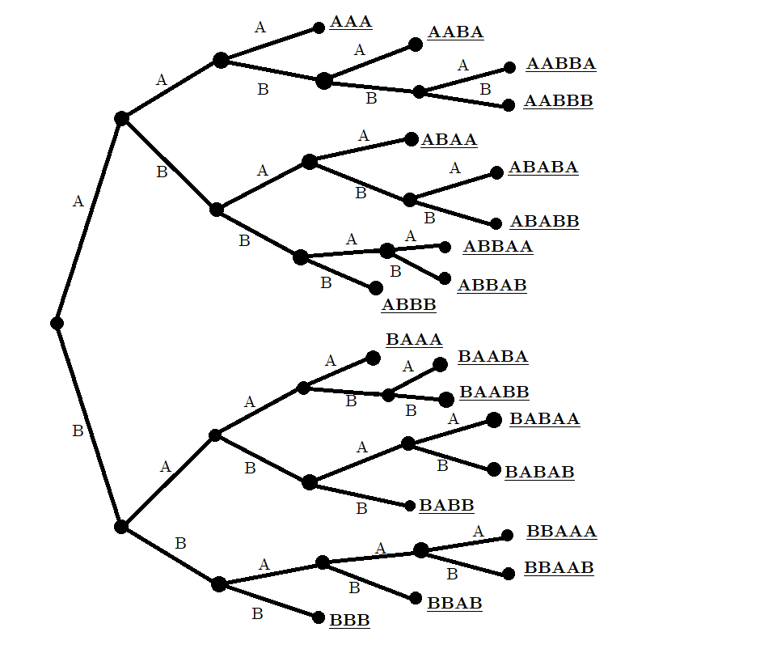

```{r setup, include=FALSE}
knitr::opts_chunk$set(echo = TRUE)
```

# Section 5.1 (p383)

## 1. Exercise 10

### Part (a)



### Part (b)

20 ways (by counting straight from the tree).

### Part (c)

3 ways (by counting straight from the tree).

### Part (d)

First of all, since exactly 4 games are played, $A$ must win the 4th game in order to win the match. Since a player needs to win 3 games to win the match, $A$ must have won 2 out of the 3 games before going into the 4th game. Since each game can only be won by either $A$ or $B$, the number of ways the above statement can happen is equal to the question from the problem.

### Part (e)

6 ways (by counting straight from the tree).

### Part (f)

4; 3.

## 2. Exercise 19

### Part (a)

Given three integers in the range of [1..6], increase the second integer by 1, and increase the third integer by 2. Write down an eight-digit binary sequence as follows: write down a "1" if the position is equal to any of the three integers, or a "0" if it is not.

### Part (b)

$$
\begin{array}{|c|c|}
  \hline
  10101000 & \{1, 2, 3\}\\
  \hline
  01010100 & \{2, 3, 4\}\\
  \hline
  00100101 & \{3, 5, 6\}\\
  \hline
  00010101 & \{4, 5, 6\}\\
  \hline
  10010010 & \{1, 3, 5\}\\
  \hline
  10010001 & \{1, 3, 6\}\\
  \hline
  00101010 & \{3, 4, 5\}\\
  \hline
  01001001 & \{2, 4, 6\}\\
  \hline
\end{array}
$$

\pagebreak
# Section 5.2 (p395)

## 3. Exercise 7

### Part (a)

$$7 \times (10 + 7 - 1) \times (10 + 7 - 2) = \boxed{1,680}$$

### Part (b)

$$7 \times 10 \times (10 + 7 - 2) = \boxed{1,050}$$

### Part (c)

$$(\frac{7 \times (7 - 1)}{2} + \frac{10 \times (10 - 1)}{2}) \times (10 + 7 - 2) = \boxed{990}$$

### Part (d)

$$
\begin{aligned}
&(10 + 7) \times (10 + 7 - 1) \times (10 + 7 - 2)\\
&\quad-\ (\frac{10 \times (10 - 1) \times (10 - 2)}{2} + \frac{7 \times (7 - 1) \times (7 - 2)}{2}) = \boxed{3,615}
\end{aligned}
$$

## 4. Exercise 21

### Part (a)

$$365^{30} = \boxed{73,924,080,909,700,308,571,344,669,689,235,259,082,192,300,936,032,301,233,150,064,945,220,947,265,625}$$

### Part (b)

$$
\begin{aligned}
  P(365, 30) &= \frac{365!}{(365 - 30)!}\\
             &= \begin{array}{|l|}
                  \hline
                  21,710,301,835,085,570,660,575,334,772,480,813,994,655,203,436,676,745,965,233,\\
                  568,177,192,960,000,000\\
                \hline
              \end{array}
\end{aligned}
$$

### Part (c)

$$1 - \frac{365^{30}}{P(365, 30)} \approx \boxed{70.6\%}$$

<!--
$$
\begin{aligned}
          &\ 1 - \frac{21,710,301,835,085,570,660,575,334,772,480,813,994,655,203,436,676,745,965,233,568,177,192,960,000,000}{73,924,080,909,700,308,571,344,669,689,235,259,082,192,300,936,032,301,233,150,064,945,220,947,265,625}\\
        = &\ \frac{9,155,292,769,247,515,688,463,664,204,581,601,330,417,463,671,119,878,183,963,440,529,188,469}{12,962,030,625,262,519,859,085,092,767,427,552,277,425,499,342,208,403,503,894,805,908,203,125}\\
  \approx &\ \boxed{70.6316242719268659956239658677303661778841551830567196342760498103760359336137658196585095007230392605069120017461857106841157498462356740140776\%}
\end{aligned}
$$
-->

This percentage is right around what I would expect as a professional statistics student.

## 5. Exercise 24.a and Exercise 32

### Exercise 24.a

$$2,380 + 2,380 - 560 = \boxed{4,200}$$

### Exercise 32

The Rules of Sums can only apply to disjoint pieces. However, the committees having Jack and the committees having Jill are not disjoint, meaning that some committees have both Jack and Jill. Therefore, the Rule of Sums cannot apply here.

*The Rule of Sums with Overlap* should be used here instead:
$$2,380 + 2,380 - 560 \text{ [the committees having both Jack and Jill]} = 4,200$$

\pagebreak
# Section 5.3 (p407)

## 6. Exercise 18

### Part (a)

$$C(100, 6) = \frac{100!}{(100 - 6)! \times 6!} = \boxed{1,192,052,400}$$

### Part (b)

Number of samples:
$$C(100 - 4, 6 - 4) = \frac{96!}{(96 - 2)! \times 2!} = \boxed{4,560}$$

Percentage:
$$\frac{4,560}{1,192,052,400} \approx \boxed{0.000\ 383\%}$$

### Part (c)

Number of samples:
$$C(100, 6) - C(100 - 4, 6) = 1,192,052,400 - \frac{96!}{(96 - 6)! \times 6!} = \boxed{265,004,096}$$

Percentage:
$$\frac{265,004,096}{1,192,052,400} \approx \boxed{22.2\%}$$

## 7. Exercise 22

$$C(20 - 2, 7) = \frac{18!}{(18 - 7)! \times 7!} = \boxed{31,824}$$

## 8. *We need to form a 5-person committee from a group of seven Idahoans and five Utahns. How many ways can this committee be formed if it must consist of at least one person from each state?*

$$
\begin{aligned}
  C(7 + 5, 5) - C(7, 5) - C(5, 5) &= \frac{12!}{(12 - 5)! \times 5!} - \frac{7!}{(7 - 5)! \times 5!} - \frac{5!}{(5 - 5)! \times 5!}\\
                                  &= \boxed{770}
\end{aligned}
$$

\pagebreak
# Section 5.4 (p417)

## 9. Exercise 4

### Part (a)

$$|\{H, S, B, O\}|^{10} = 4^{10} = \boxed{1,048,576}$$

### Part (b)

$$
\begin{aligned}
  C(10, 3) \times |\{S, B, O\}|^{10-3} &= \frac{10!}{(10 - 3)! \times 3!} \times 3^7\\
                                       &= \boxed{262,440}
\end{aligned}
$$

### Part (c)

$$
\begin{aligned}
    &\ C(10, 4) \times C(10 - 4, 1) \times C(10 - 4 - 1, 2) \times C(10 - 4 - 1 - 2, 3)\\
  = &\ \frac{10!}{(10 - 4)! \times 4!} \times \frac{6!}{(6 - 1)! \times 1!} \times \frac{5!}{(5 - 2)! \times 2!} \times \frac{3!}{(3 - 3)! \times 3!}\\
  = &\ \boxed{12,600}
\end{aligned}
$$

## 10. Exercise 6

### Part (a)

$$
\begin{aligned}
  C(3, 3) + C(4, 3) + C(5, 3) &= \frac{3!}{(3 - 3)! \times 3!} + \frac{4!}{(4 - 3)! \times 3!} + \frac{5!}{(5 - 3)! \times 3!}\\
                              &= \boxed{15}
\end{aligned}
$$

### Part (b)

$$C(6, 4) = \frac{6!}{(6 - 4)! \times 4!} = \boxed{15}$$

### Part (c)

Let a binary sequence of length at most 5 with exactly three "1"s be given. Take the sequence and add another "1" at the end, followed by just enough "0"s to make the sequence 6 bits long. What ends up will be a 6-bit binary sequence with exactly four "1"s.

Similarly, let a binary sequence of length 6 with exactly four "1"s be given. Take the sequence and simply delete the last "1" and everything after it. What ends up will be a binary sequence with exactly three "1"s while being 5-bit or shorter.

Now, since there is a one-to-one correspondence between those two types of binary sequences, there must be the same number of them.

## 11. Exercise 11

$$|\{C, H, E, N\}|! = 4! = \boxed{24}$$

## 12. Exercise 22

  * 4 types of items in total: $n = 4$.
  
  * 15 items in total, but with at least 1 of each type: $r = 15 - 4 \times 1 = 11$.

By *Theorem 3*, the total number of ways to buy is
$$C(n + r - 1, r) = C(4 + 11 - 1, 11) = \frac{14!}{(14 - 11)! \times 11!} = \boxed{364}$$

## 13. Exercise 26

  * Rewriting the problem: "how many unordered lists of length 2 can be made from the set {Andrew, Bob, Carly, Diane}, with repetitions allowed?"
  
  * Answer to the above problem (using *Theorem 3*):

$$
\begin{aligned}
  &n = |\text{\{Andrew, Bob, Carly, Diane\}}| = 4, r = 2;\\
  &C(n + r - 1, r) = C(4 + 2 - 1, 2) = \frac{5!}{(5 - 2)! \times 2!} = \boxed{10}
\end{aligned}
$$

