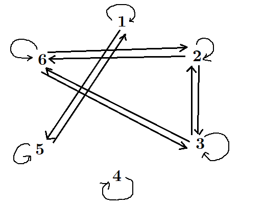

```{r setup, include=FALSE}
knitr::opts_chunk$set(echo = TRUE)
```

# Problem 1

## Part (a)

$$h(x) = f(f(x)) = f(2x - 1) = 2 \cdot (2x - 1) - 1 = \boxed{4x - 3}$$

## Part (b)

$$g(x) = f(f(f(x))) = f(4x - 2) = 2 \cdot (4x - 2) - 1 = \boxed{8x - 7}$$

\pagebreak
# Problem 2

## Part (a)

No, the function $f$ is not one-to-one because
$$f(1) = \frac{4!}{(4 - 1)! \times 1!} = \frac{24}{6 \times 1} = 4$$
and
$$f(3) = \frac{4!}{(4 - 3)! \times 3!} = \frac{24}{1 \times 6} = 4 = f(1)$$
but $1 \ne 3$.

## Part (b)

No, the function $f$ is not onto because there does not exist an $x$ in the domain where $f(x) = 2$ (but 2 is in the codomain):
$$
\begin{aligned}
  f(1) &= \frac{4!}{(4 - 1)! \times 1!} = \frac{24}{6 \times 1} = 4,\\
  f(2) &= \frac{4!}{(4 - 2)! \times 2!} = \frac{24}{2 \times 2} = 6,\\
  f(3) &= \frac{4!}{(4 - 3)! \times 3!} = \frac{24}{1 \times 6} = 4,\\
  f(4) &= \frac{4!}{(4 - 4)! \times 4!} = \frac{24}{1 \times 24} = 1
\end{aligned}
$$

\pagebreak
# Problem 3

## Part (a)

Let $a, b \in \mathbb{Z}$ be given such that $f(a) = f(b)$. By definition of the function $f$, we have
$$d \cdot a = d \cdot b$$

Dividing by $d$ on both sides, we have
$$a = b$$

By definition of one-to-one, the function $f$ is one-to-one. $\square$

## Part (b)

First, let us show that the function $g$ is onto.

Let $y \in \mathbb{Z}$ be given.

Let $x = d + y$. By definition of the function $g$ and the definition of modulo,
$$g(x) = x \bmod d = (d + y) \bmod d = y$$

By definition of onto, the function $g$ is onto.

Now, to show that the function $g$ is not one-to-one, we have
$$g(1) = 1 \bmod d = 1$$
and
$$g(d + 1) = (d + 1) \bmod d = 1 = g(1)$$
but $1 \ne d + 1$ since $d > 1$. Therefore, by definition of one-to-one, the function $g$ is not one-to-one. $\square$

\pagebreak
# Problem 4

## Part (a)

Let an element $A \in Q(X)$ be given.

By definition of a subset, $A \subseteq A$.

By definition of the relation $R$, $(A, A) \in R$.

Therefore, by definition of reflexive, the relation $R$ is reflexive. $\square$

## Part (b)

Let $A = \{1, 2, 3\}$. Since $A \subseteq Q$ and $|A| \ge 3$, $A \in Q(X)$.

However, $A \cap A = \{1, 2, 3\} \ne \emptyset$, meaning that $(A, A) \notin S$, by definition of the relation $S$.

Therefore, by definition of reflexive, the relation $S$ is not reflexive. $\square$

## Part (c)

Let $A = \{1, 2, 3\}$. Since $A \subseteq Q$ and $|A| \ge 3$, $A \in Q(X)$.

However, $A \cup A = \{1, 2, 3\} \ne X$, meaning that $(A, A) \notin T$, by definition of the relation $T$.

Therefore, by definition of reflexive, the relation $T$ is not reflexive. $\square$

\pagebreak
# Problem 5

## Part (a)

Let $(a, b) \in Q \cap S$ be given, where $a \ne b$. By definition of an intersection, $(a, b) \in Q$.

Since $Q$ is antisymmetric, $(b, a) \notin Q$.

However, by definition of an intersection, if some element $x \notin Q$, then $x \notin Q \cap S$.

Therefore, $(b, a) \notin Q \cap S$. Now, by definition of antisymmetric, the relation $Q \cap S$ is antisymmetric. $\square$

## Part (b)

Let $A = \{1, 2, 3\}$, $R = \{(1, 2)\}$, and $T = \{(2, 3)\}$. By definition of transitive, the relations $R$ and $T$ are both transitive.

However, $R \cup T = \{(1, 2), (2, 3)\}$ is not transitive since $(1, 3) \notin R \cup T$.

\pagebreak
# Problem 6

**First, let us show that the relation $R$ is reflexive.**

Let $a \in \mathbb{Z}$ be given. Since $a = a^1$, by definition of the relation $R$, $(a, a) \in R$.

By definition of reflexive, the relation $R$ is reflexive.

**Next, let us show that the relation $R$ is antisymmetric.**

Let $(a, b) \in R$ be given such that $(b, a) \in R$. By definition of the relation $R$, we have $b = a^r, a = b^s$ for some positive integers $r, s$.

Since $r, s > 0$, the only way this can happen is when $r = s = 1$. The reason is, if $b = a^r$, then $a = b^{1/r}$, meaning that $s = \frac{1}{r}$, but $r$ and $s$ are both integers.

Now, since $s = 1$, we have that $a = b^s = b^1 = b$.

By definition of antisymmetric, the relation $R$ is antisymmetric.

**Finally, let us show that the relation $R$ is transitive.**

Let $(a, b), (b, c) \in R$ be given. By definition of the relation $R$, we have $b = a^r, c = b^s$ for some positive integers $r, s$.

Now, we have $c = b^s = (a^r)^s = a^{rs} = a^t$ where $t = rs$. By closure under multiplication, $t \in \mathbb{Z}$, and since $r, s > 0$, $t > 0$.

By definition of the relation $R$, $(a, c) \in R$, and by definition of transitive, the relation $R$ is transitive.

___

Therefore, since the relation $R$ is reflexive, antisymmetric, and transitive, by definition of a partial order, the relation $R$ is a partial order on $\mathbb{Z}$. $\square$

\pagebreak
# Problem 7

## Part (a)

No, this is not a partition of $S$ because $\{1, 3, 5\} \cup \{2, 6\} \cup \{4, 8, 9\} = \{1, 2, 3, 4, 5, 6, 8, 9\} \ne S$.

## Part (b)

No, this is not a partition of $S$ because $\{1, 3, 5\} \cap \{5, 7, 9\} = \{5\} \ne \emptyset$.

## Part (c)

Yes, this is a partition of $S$ because

  * $\{1, 3, 5\}, \{2, 4, 6, 8\}$ and $\{7, 9\}$ are all not empty;
  
  * $\{1, 3, 5\}, \{2, 4, 6, 8\}$ and $\{7, 9\}$ are all disjoint to each other; and
  
  * $\{1, 3, 5\} \cup \{2, 4, 6, 8\} \cup \{7, 9\} = S$.

## Part (d)

Yes, this is a partition of $S$ because

  * $\{1, 2, 3, 4, 5, 6, 7, 8, 9\}$ is not empty;
  
  * $\{1, 2, 3, 4, 5, 6, 7, 8, 9\}$ is the only set in the set *(d)* (so there is not a potential set to be not disjoint to this set); and
  
  * $\{1, 2, 3, 4, 5, 6, 7, 8, 9\} = S$.

\pagebreak
# Problem 8

Generating an arrow diagram for the relation $R$:



As seen from the above diagram, there are three clear "independent islands": $\{1, 5\}, \{2, 3, 6\}$, and $\{4\}$. Therefore, the partition of $A$ induced by the relation $R$ is:
$$\{\{1, 5\}, \{2, 3, 6\}, \{4\}\}$$

\pagebreak
# Problem 9

## Part (a)

$R = \{(2, 2), (2, 6), (2, 24), (6, 6), (6, 24), (24, 24)\}$.

Yes, this set is totally ordered because the relation $R$ is reflexive, antisymmetric, transitive and satisfies the "comparable" property.

## Part (b)

$R = \{(3, 3), (3, 15), (5, 5), (5, 15), (15, 15)\}$.

No, this set is not totally ordered because it does not satisfy the "comparable" property. (The relation $R$ does not contain $(3, 5)$ or $(5, 3)$.)

## Part (c)

No, this set is not totally ordered because it does not satisfy the "comparable" property. (For example, the relation $R$ does not contain $(2, 3)$ or $(3, 2)$ since 2 and 3 are coprimes.)

## Part (d)

$R = \{(2, 2), (2, 4), (2, 8), (2, 32), (4, 4), (4, 8), (4, 32), (8, 8), (8, 32), (32, 32)\}$.

Yes, this set is totally ordered because the relation $R$ is reflexive, antisymmetric, transitive and satisfies the "comparable" property.

## Part (e)

$R = \{(7, 7)\}$.

Yes, this set is totally ordered because the relation $R$ is reflexive, antisymmetric, transitive and satisfies the "comparable" property.

## Part (f)

$R = \{(5, 5), (5, 15), (5, 30), (15, 15), (15, 30), (30, 30)\}$.

Yes, this set is totally ordered because the relation $R$ is reflexive, antisymmetric, transitive and satisfies the "comparable" property.

