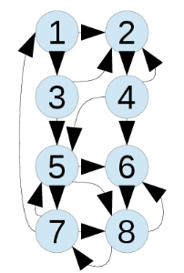

```{r setup, include=FALSE}
knitr::opts_chunk$set(echo = TRUE)
```

Linear Algebra is mainly the study in solving systems of linear equations and linear functions. In the modern world, Linear Algebra is used in many aspects of computing. As a Computer Science student, more specifically, one that is looking into the fields of Artificial Intelligence, I would like to know more about the heart of how computers think. Linear Programming gives my research a great starting point because it uses many basic ideas of Linear Algebra to solve real-world problems.

## Canonical Linear Programming Problems

Linear Programming uses Linear Algebra to analyze a system of some situation and tries to optimize it under a set of conditions. Linear Programming is the base of the study in optimization techniques, and it is used to solve problems from different areas, including economics, science, and engineering [@lewis, section 1].

A critical part of Linear Algebra is to describe systems with linear relationships between variables using vector equations or matrix equations, where some constraints on the variables can be applied. By performing algebraic operations on the matrices, we can find the optimal solutions to the system, and this uses the basic idea in Linear Algebra of solving systems of equations. Furthermore, a systematic way to describe a real-world problem using Linear Algebra language and solving the problem can look like this [@miller, section 1.2]: reducing the problem down to the *Canonical* form, finding the *feasible* solutions, and further finding the *optimal* solutions.

A Canonical Linear Programming has this basic form [@miller, section 1.2.2]:

  1. We have variables $x_j \ge 0$ for $j \in \{1, 2, \cdots, n\}$.
  2. The variables satisfy linear constraints, which we can write as $A\mathbf{x} = \mathbf{b}$.
  3. The goal is to minimize a linear function of variables: $c^Tx = c_1x_1 + c_2x_2 + \cdots + c_nx_n$.

One important and straightforward use of this type of Linear Programming is when dealing with transportation problems. The purpose of a transportation problem, essentially, is to minimize the cost of shipping from one place to another, with the constrains being that the needs at all target areas are met while all shipping operation fall within their capacities. Here is an example of a transportation problem solved Linear Programming, simplified [@reeb, page 3-5]:

Suppose we have a sawmill company's harvesting group wanting to move to 3 different sites. They estimated the number of truckloads coming off each harvest sites daily and recorded the distance to each sawmill:

$$
\begin{array}{|c|rrr|c|}
  \hline
  \text{Site}        & \text{Dist to mill }A & B  & C  & \text{Max truckloads} \\
  \hline
  1                  & 8                     & 15 & 50 & 20 \\
  2                  & 10                    & 17 & 20 & 30 \\
  3                  & 30                    & 26 & 15 & 45 \\
  \hline
  \text{Mill demand} & 30                    & 35 & 30 & \text{} \\
  \hline
\end{array}
$$

Suppose that the average haul cost is $2 per mile (for both loaded and empty trucks). We can then calculate the costs to haul from each site to each mill, based on the above distances:

$$
\begin{array}{|c|rrr|c|}
  \hline
  \text{Site}        & \text{Cost to mill }A & B   & C \\
  \hline
  1                  & 32                    & 60  & 200 \\
  2                  & 40                    & 68  & 80 \\
  3                  & 120                   & 104 & 60 \\
  \hline
\end{array}
$$

Since we want to minimize the costs while not exceeding the maximum number of truckloads from each site, based on the above information, we can create the following system of Linear Programming problem in Canonical form:

Let $x_{ij}$ be the cost to haul from site $i$ to mill $j$,

Minimize $32x_{1A} + 40x_{2A} + 120x_{3A} + 60x_{1B} + 68x_{2B} + 104x_{3B} + 200x_{1C} + 80x_{2C} + 60x_{3C}$,

Subject to

$$
\begin{aligned}
  x_{1A} + x_{2A} + x_{3A} &\ge 30, \\
  x_{1B} + x_{2B} + x_{3B} &\ge 35, \\
  x_{1C} + x_{2C} + x_{3C} &\ge 30, \\
  x_{1A} + x_{1A} + x_{1A} &\le 20, \\
  x_{2B} + x_{2B} + x_{2B} &\le 30, \\
  x_{3C} + x_{3C} + x_{3C} &\le 45, \\
\end{aligned}
$$

By finding the optimal solution to the above Canonical system, we can come up with the following optimal schedules:

$$
\begin{array}{|cc|cc|c|}
  \hline
  \text{From site} & \text{To mill} & \text{Truckloads} & \text{Cost per load} & \text{Total cost} \\
  \hline
  1                & A              & 20                & 32                   & 640 \\
  1                & B              & 0                 & 60                   & 0 \\
  1                & C              & 0                 & 200                  & 0 \\
  \hline
  2                & A              & 10                & 40                   & 400 \\
  2                & B              & 20                & 68                   & 1,360 \\
  2                & C              & 0                 & 80                   & 0 \\
  \hline
  3                & A              & 0                 & 12                   & 0 \\
  3                & B              & 15                & 104                  & 1,560 \\
  3                & C              & 30                & 60                   & 1,800 \\
  \hline
  \text{(Total)}   &                &                   &                      & 5,760 \\
  \hline
\end{array}
$$

As we can see from the above example, Linear Programming can simplify up a system by a fair amount. The more amazing thing is that the solving process of such a problem can be treated as a pattern and be easily built into a computer program, where more complex linear systems can be represented and optimized very quickly.

## Search Engines and the PageRank Algorithm

We all know that we make use of search engines every day. Some popular search engines include Google, Bing, Yahoo, and my personal favorite, DuckDuckGo. A good search engine can find the information we need, given just a few keywords, out of billions of webpages. The way that search engine is able to handle such a large amount of data sources and magically figure out what I need within a fraction of a second has always let me wonder.

Therefore, I believe that search engines are a great example of modern artificial intelligence and is worth doing a research on. Moreover, having an idea of how search engines is connected to Linear Algebra can help me appreciate the power of mathematics ever more, given that search engines are also a product of Artificial Intelligence.

As it turns out, similar to how Linear Programming tries to find the optimal state of a system, a modern search engine also uses Linear Algebra to find out which webpages are the most likely what the user needs. However, this did not happen until 1998, when link-analysis algorithms were finally developed, making today's search engines run remarkably accurately and fast [@langville, section 1].

Google was first developed in the 1990s. Always ranking the more relevant results up front had always been the thing that set Google apart from other search engines. It was mainly because of the *PageRank* algorithm run by Google, which allowed the search engine to sort webpages more fitting the users' needs [@bryan, section 1].

The basic idea of the PageRank algorithm is to count the number of citations or back-links to a given page and uses it to approximate a page's importance or quality [@shariq, page 3]:

  > Suppose that a page $P_j$ has $l_j$ links. If one of those links is to page $P_i$, then $P_j$ will pass on $\frac{1}{l_j}$ of its importance to $P_i$. Let the set of all the pages linking to $P_i $ be denoted by $B_i$. Hence the PageRank of $P_i$ is given by
  $$I(P_i) = \sum_{P_j \in B_i} \frac{I(P_j)}{l_j}$$

Here is a more realistic example of ranking a list of webpages using the PageRank algorithm [@shariq, page 4]: 

Consider a web that consists of 8 pages:



By counting the arrows coming into and going out of each webpage, we can build the following hyperlink matrix:

$$
H = \begin{bmatrix}
  0 & 0 & 0 & 0 & 0 & 0 & \frac{1}{3} & 0 \\
  \frac{1}{2} & 0 & \frac{1}{2} & \frac{1}{3} & 0 & 0 & 0 & 0 \\
  \frac{1}{2} & 0 & 0 & 0 & 0 & 0 & 0 & 0 \\
  0 & 1 & 0 & 0 & 0 & 0 & 0 & 0 \\
  0 & 0 & \frac{1}{2} & \frac{1}{3} & 0 & 0 & \frac{1}{3} & 0 \\
  0 & 0 & 0 & \frac{1}{3} & \frac{1}{3} & 0 & 0 & 0 \\
  0 & 0 & 0 & 0 & \frac{1}{3} & 0 & 0 & \frac{1}{2} \\
  0 & 0 & 0 & 0 & \frac{1}{3} & 1 & \frac{1}{3} & 0
\end{bmatrix},\text{ where }H_{ij} = \begin{cases}
  \frac{1}{l_j},\text{ if }P_j \in B_i \\
  0,\text{ otherwise}
\end{cases}
$$

By finding the *eigenvector* $I$ of the above matrix, we can figure out the most popular webpage and sort them by relevance:

$$
I = \begin{bmatrix}
  0.06 \\
  0.0675 \\
  0.03 \\
  0.0675 \\
  0.0975 \\
  0.2025 \\
  0.18 \\
  0.295
\end{bmatrix}
$$

As we can see from the result of the algorithm, webpage 8 is the most relevant, followed by webpage 6, and so on.

This is another example of Linear Algebra simplifying down a complicated problem. Amazingly, it also reminds me of how import it is to study property of matrices and continue the research of what Linear Algebra can do for us -- continue coming up with more efficient ways to perform matrix arithmetic will always be important and helpful for our future computing world.

\pagebreak
## Works Cited

